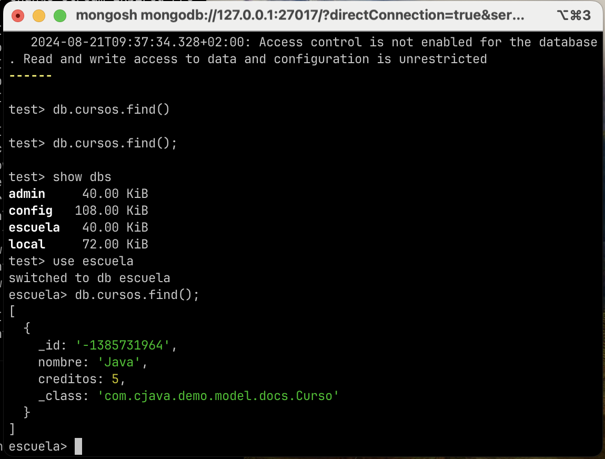
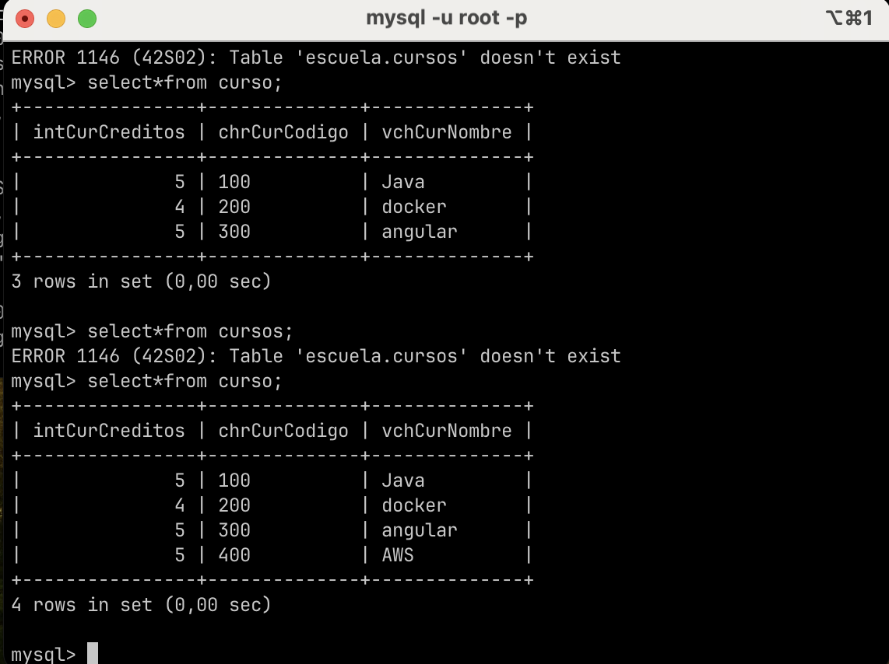
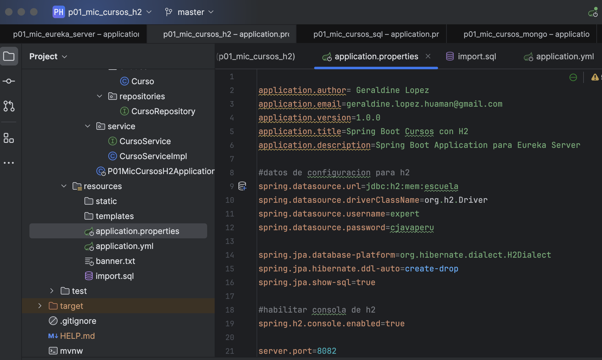
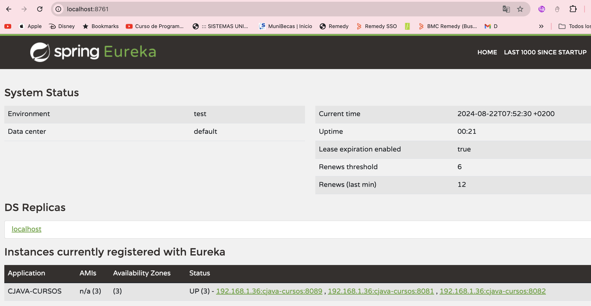
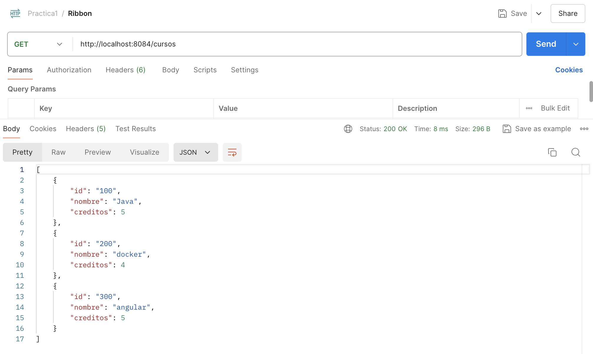
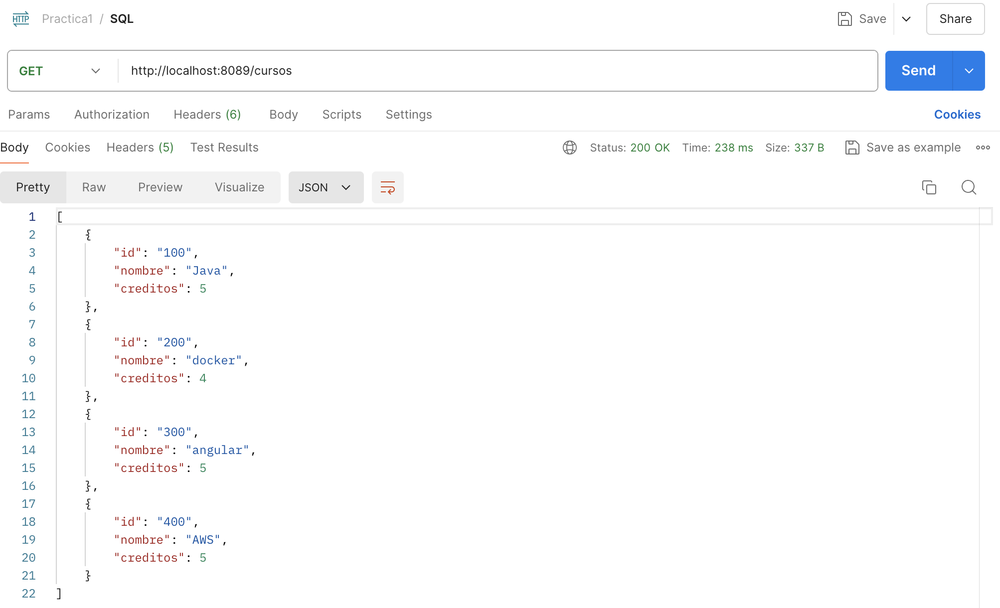
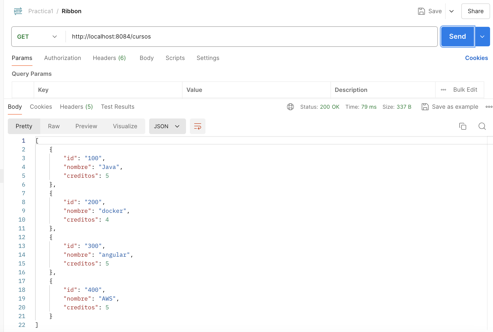
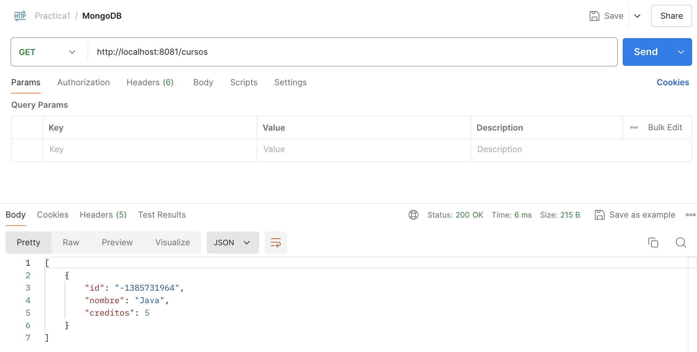
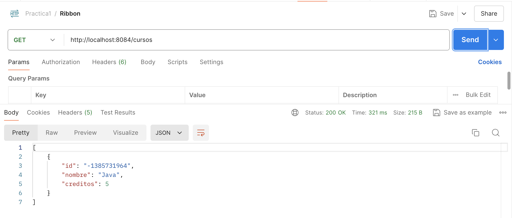

# Practica 1

1. Crear los microservicios necesarios para implementar el caso de negocio que usted crea conveniente (Alumno, Cursos, matricula), (Cliente, Compras), etc., indicar los subdominios y los bounded context que generaron estos microservicios,
   utilizando para cada microservicio un SGBD diferentes - (10 pts)

``
Se creó 3 microservicios con Base de datos diferentes:

MONGODB

MYSQL

H2

``

2. Registrar estos microservicios en un servidor de descubrimiento Eureka - (5 pts)

``Se muestra el registro de los 3 microservicios de cursos.``

3. Uno de los microservicios creados debe invocar al otro mediante openFeign,

esta invocación debe estar balanceada con Ribbon, para ello deberá levantar 2

instancias del microservicio invocado - (5 pts)

``El microservicio cliente-ribbon invoca a los 3 microservicios usando openFeign y ribbon en un entorno que usa Java 11

H2

MYSQL

MONGO

``

